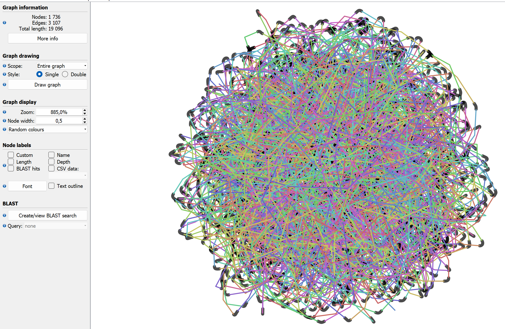
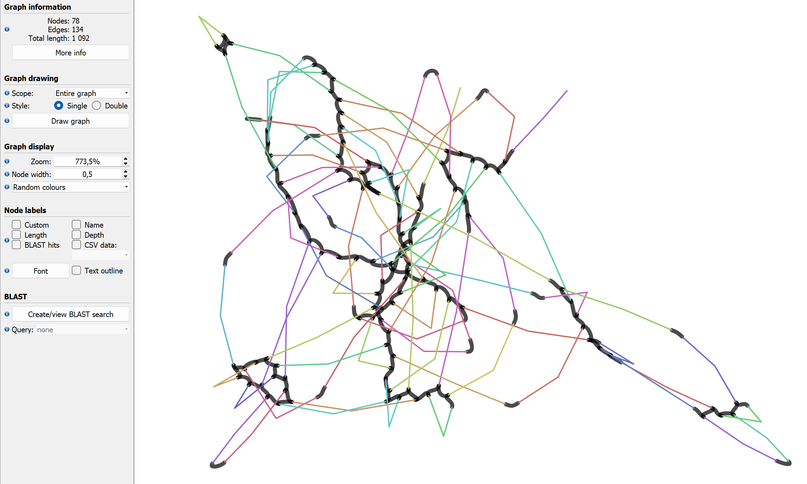
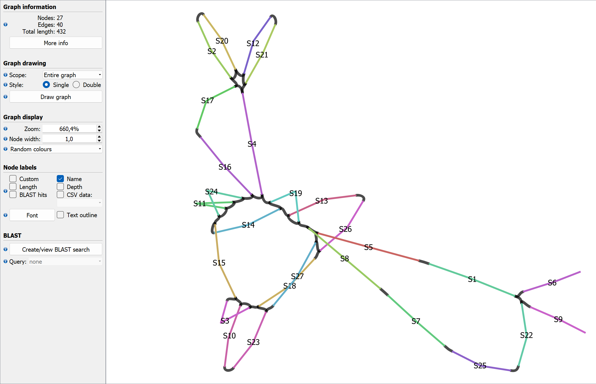
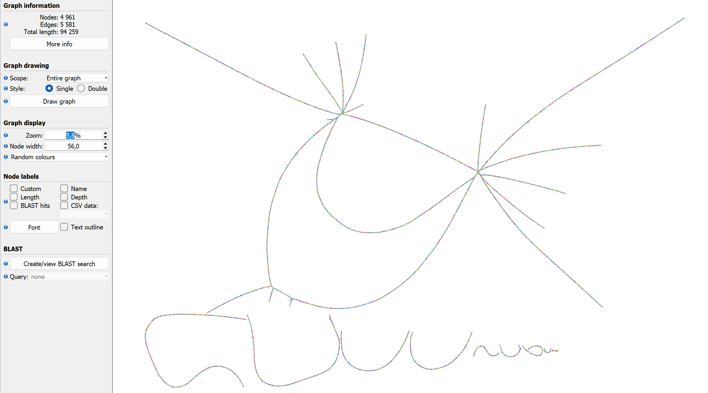
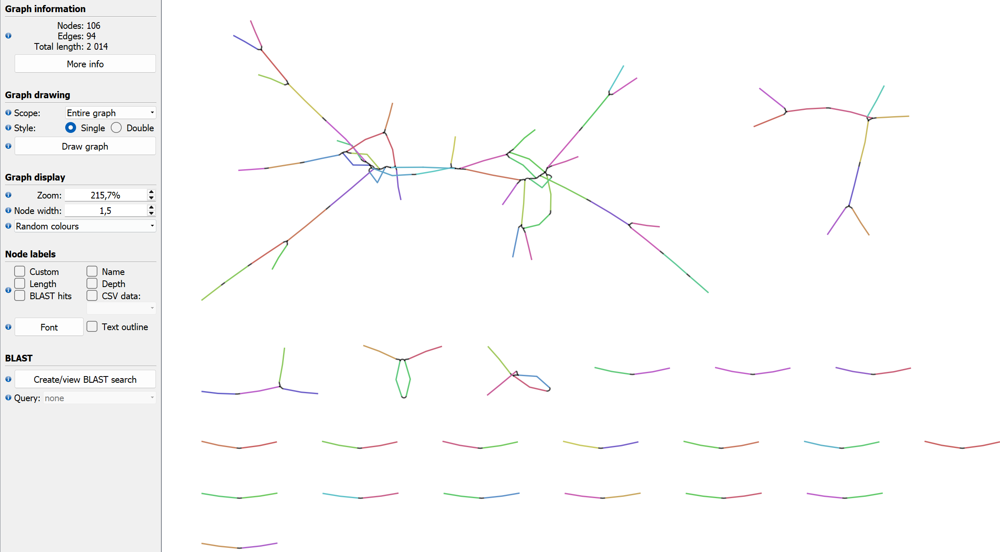
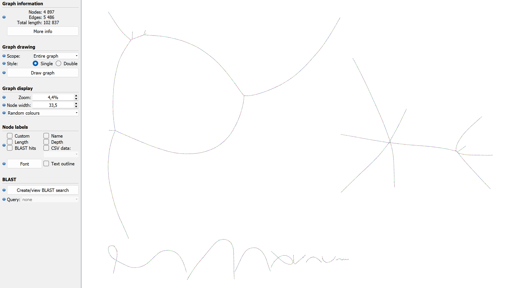
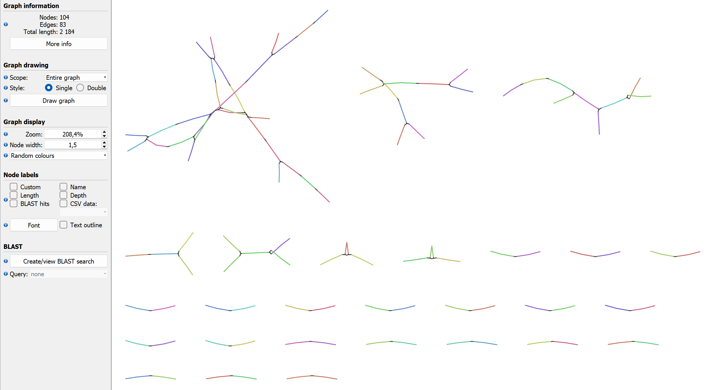

# Алгоритмы геномной сборки

## Цель работы

Реализовать программу для построения графа де Брейна по данным в форматах FASTA и FASTQ, выполнить сжатие и очистку графа, сохранить результаты в форматах FASTA и GFA и проанализировать влияние параметра `k` на структуру графа.

## Реализация

Программа написана на Java и состоит из нескольких частей:
- `SequenceReader` — чтение последовательностей из FASTA и FASTQ;
- `DeBruijnGraph` и `DeBruijnEdge` — хранение графа;
- `GraphUtils` — построение, сжатие и очистка графа;
- `GraphWriter` — сохранение контигов в FASTA и графа в GFA;
- `DeBruijnAssembler` — запуск программы.

При построении графа вершины соответствуют `k`-мерам, а ребра — `(k+1)`-мерам. Для каждого ребра хранится его последовательность и глубина покрытия, то есть число вхождений данного `(k+1)`-мера во входных данных.

После построения выполняется сжатие графа: линейные пути заменяются одним ребром, на котором хранится вся последовательность пути. Покрытие такого ребра вычисляется по входящим в него `(k+1)`-мерам.

Для упрощения графа используются две эвристики:
- удаление ребер с низким покрытием;
- удаление коротких тупиковых ветвей.

После очистки граф повторно сжимается.

## Использование

Запуск программы осуществляется с помощью bash-скрипта `execute.sh`, примеры команд для анализа данных в зависимости от формата и цели находятся в `workflows.sh`

## Анализ графов для референсного генома кишечной палочки

Для референсного генома были построены графы при разных значениях `k`.

Изображение для референсного генома при к = 11.

Изображение для референсного генома при к = 14.

Изображение для референсного генома при к = 16.

При меньших значениях `k` граф получается более связным, но в нем больше ветвлений и неоднозначных соединений, так как короткие отрезки чаще повторяются в разных местах последовательности.

При увеличении `k` структура графа становится проще. Таким образом, для референса увеличение `k` делает граф более понятным и менее запутанным.

## Анализ графов для прочтений из референсного генома

Графы, построенные по прочтениям, оказались значительно сложнее, чем графы по референсу. Это связано с ошибками секвенирования, большим количеством коротких последовательностей и неравномерным покрытием.

Изображение для прочтений при к = 19.

Изображение для прочтений при к = 19 с очисткой.

Изображение для прочтений при к = 21.

Изображение для прочтений при к = 21 с очисткой.

До очистки граф содержит много коротких ветвей и лишних соединений. При малых значениях `k` структура получается особенно запутанной. Это происходит потому что короткие отрезки часто совпадают между разными прочтениями.

После очистки граф упрощается: удаляются короткие тупиковые ветви и ребра с низким покрытием, уменьшается число лишних ветвей, а основные компоненты становятся лучше различимы.

## Влияние параметра `k`

Параметр `k` сильно влияет на структуру графа:
- малые значения `k` делают граф более связным, но делают его более неоднородным;
- большие значения `k` уменьшают количество склеек, но могут приводить к разрывам графа.

Выбор параметра `k` влияет как на связность графа, так и на его точность.

## Вывод

В ходе работы была реализована программа для чтения FASTA/FASTQ, построения графа де Брейна, его сжатия, очистки и сохранения результатов в FASTA и GFA.

Анализ показал, что для референсного генома увеличение `k` упрощает структуру графа, а для прочтений особенно важна очистка графа, так как без нее он содержит большое количество шумовых ветвей и лишних соединений.

Таким образом, качество графа де Брейна зависит как от выбора параметра `k`, так и от применения методов очистки.